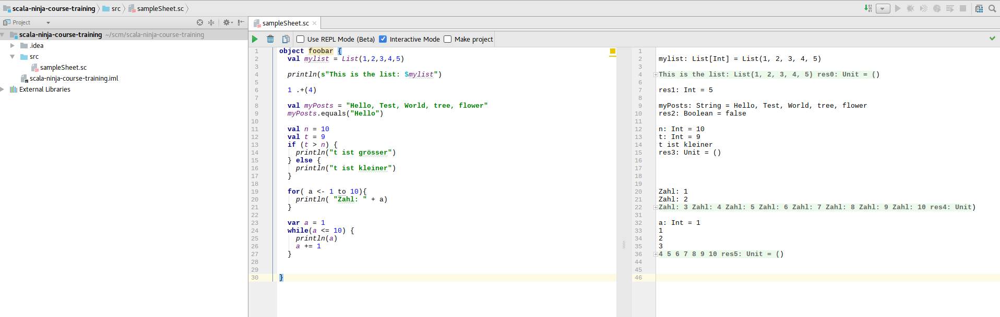
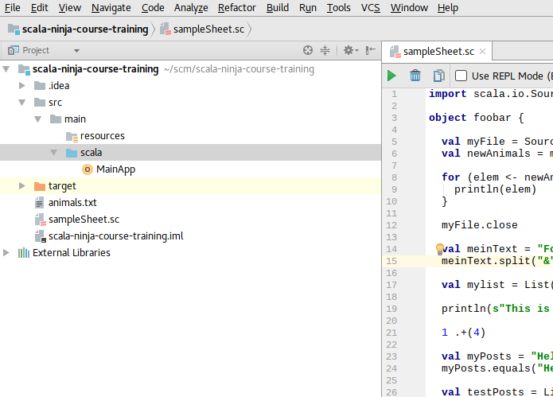
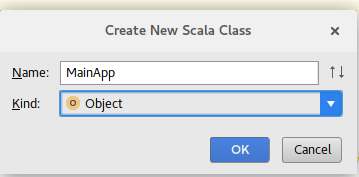

T-05 IDE "IntelliJ IDEA" einsetzen
==================================

Wir werden als "Integrated Development Environment" die IntelliJ IDEA Community Version einsetzen um das Programmieren mit Scala zu vereinfachen.

Die *IDE* ist in Prinzip nichts Anderes als einen intelligenteren Text-Editor.

Um mit IntelliJ IDEA als *IDE* zu programmieren, muss zuerst ein neues *Projekt* erstellt werden in der IDE:

* Gehe auf *Datei > Neu*
* Wähle *Projekt...* aus
* Wähle *Scala* aus und klicke auf *Weiter*
* Gib deinem Projekt einen Namen, z.B. *scala-ninja-course-training*
* Klicke auf *Beenden/Finish*, IntelliJ erstellt dir dann ein neues Projekt mit dem du dann starten kannst

Wir werden zuerst das *Scala-Worksheet* kennenlernen. Dieses *Scala-Worksheet* erlaubt einem die praktisch gleiche Handhabung in der IDE zu haben, wie wenn
man es auf der Kommandozeile bedient.

Das *Scala-Worksheet* kann man sehr gut fürs Lernen von Scala einsetzen, weil es die Befehle grad direkt für dich ausführt und du schnell die Resultate überprüfen kannst.

Du kannst dir das *Scala-Worksheet* als eine Art *Notiz-Mappe* vorstellen, wo du schnell Dinge notieren und skizzieren kannst.

Um ein neues *Scala-Worksheet* zu erstellen, kannst du in deiner IDE wie folgt vorgehen:

* Im Menü oben *File/Datei* auswählen
* Dann *New/Neu* wählen
* Dann *Scala-Worksheet* anklicken
* Anschliessend kannst du einen eigenen Namen für dein erstes *Scala-Worksheet* eingeben

Als nächstes werden wir eine Scala-Datei erstellen und das als Programm ausführen:

* Stelle sicher, dass du im Projekt-Ordner deinen Source-Code Ordner ausgewählt hast, weil je nach dem was man angewählt hat, gibt es andere Menu-Optionen

* Wähle *Datei > Neu*
* Klicke auf *Scala Class*
* Im Dialog wähle als *Typ* *Objekt* aus und nicht *Klasse*

* Fertig

Jetzt kannst du in dieser Datei deinen Code schreiben.